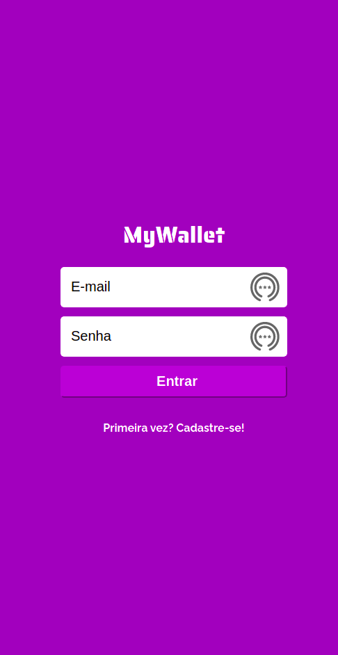
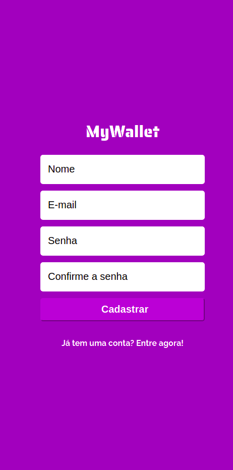
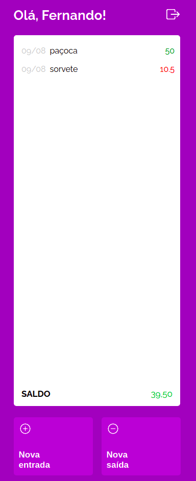
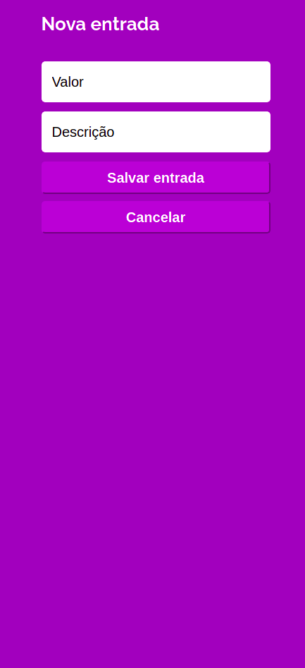

<h1 align="center">
    My Wallet
</h1>

## About

Um aplicativo prático para você controlar suas finanças de uma forma ainda mais fácil. <a href="https://front-my-wallet.vercel.app" target="_blank">Teste aqui!</a>

---

## Layout

### Mobile

  
  

  
  

---

## Tech Used

The following tools were used in the construction of the project:

- ****
- ****
- ****
- ****
- ****
- ****

## Authors

<a style="border-radius: 50px;" width="100px;" href="https://github.com/fevalani">
 
  
 <b>Fernando Valani</b></a>
  

## 

## License

👋🏽 Get in Touch!

---
